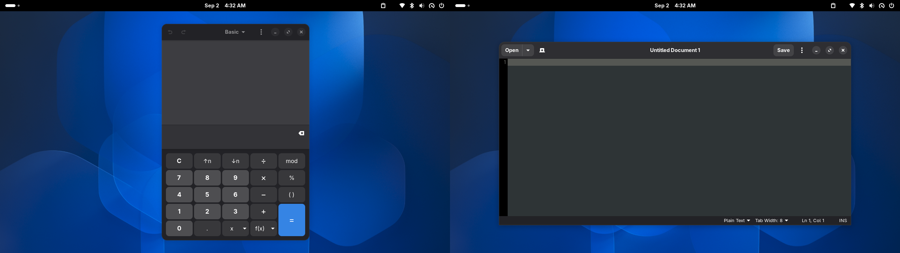
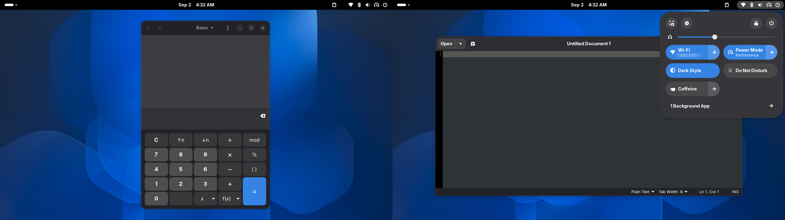
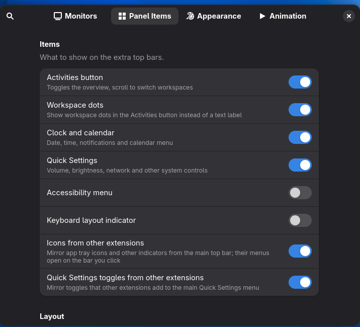

# Topbar Tweaks

<div align="center">

<a href="https://ko-fi.com/bkrbnkr"></a>

</div>

A GNOME Shell extension that shows the top bar on more than one monitor.

GNOME only puts its top bar on the primary monitor. Topbar Tweaks adds a
fully interactive top bar to your other monitors. It is not a mirror or a
dumb clone: each bar has its own working Activities button, clock and
calendar menu, and a complete Quick Settings menu that opens on the monitor
it belongs to.





## Features

- **Per-monitor bars**: add a bar to every secondary monitor, or pick
  monitors by connector (DP-1, HDMI-1 and so on).
- **Real panel items**
  - Activities button with live workspace dots (scroll it to switch
    workspaces), or a plain text label
  - Clock with the full calendar and notifications menu
  - Full Quick Settings (volume, brightness, network, Bluetooth, power,
    dark mode and the rest)
  - Optional accessibility menu and keyboard layout indicator
- **Works with your other extensions**
  - Icons that other extensions add to the main top bar (app tray icons
    from AppIndicator, clipboard managers, Caffeine, drive menu, GSConnect
    and others) are mirrored onto every extra bar as live, clickable
    copies. Their menus open on the monitor you clicked. Middle click and
    scroll are forwarded to the real indicator, so tray icon shortcuts
    keep working.
  - Toggles and sliders that extensions add to the main Quick Settings
    menu show up in the extra bars' Quick Settings too, with live state.
    Sliders are synced both ways.
  - Blur my Shell's panel blur and transparency apply to the extra bars.
  - Both mirrors can be turned off in the settings.
- **Appearance**
  - Clock position: left, center or right
  - Bar position: top or bottom edge
  - Bar height, background opacity, custom background color
  - Hide in the overview
- **Fullscreen behavior**
  - Hide a bar while a window is fullscreen on its monitor
  - Bars slide out and back in instead of vanishing. Pick which bars
    animate (all, main only, secondary only, none), the slide durations
    and one of 14 easing curves.
  - Pressure reveal: push the pointer against the screen edge to bring a
    hidden bar back for a moment. The pressure needed, the time window
    and the hide delay are adjustable.
- Follows your shell theme by default. Bars reserve their space (struts),
  so maximized windows stay out of the way, and they take part in
  Ctrl+Alt+Tab focus.

## Preferences



## Requirements

GNOME Shell 48-50 (developed and tested on GNOME 50).

## Install

1. Build the schema and copy the files into place:

   ```bash
   make install
   ```

2. Log out and back in (required on Wayland).
3. Enable the extension:

   ```bash
   gnome-extensions enable topbar-tweaks@beekrbonkr.github.io
   ```

Open the settings with:

```bash
gnome-extensions prefs topbar-tweaks@beekrbonkr.github.io
```

The About page of the settings links to this repository, the issue tracker,
my other extension [Always On Indicate](https://github.com/BeekrBonkr/AlwaysOnIndicate),
my GitHub profile and Ko-fi.

## Known limitations with other extensions

- Only toggles and sliders from the main Quick Settings are mirrored. Other
  custom widgets an extension puts there stay on the primary monitor.
- A mirrored Quick Settings toggle triggers its main action. Arrow submenus
  of such toggles open in the primary Quick Settings only.

## Testing in a nested shell

You can try the extension without logging out. This starts a nested GNOME
Shell with two virtual monitors:

```bash
make test
```

---

## Support

<div align="center">

This extension is free and open source, and I work on it in my spare time.<br>
If it saved you some time, you can buy me a coffee. No pressure - the code stays free either way.

<a href="https://ko-fi.com/bkrbnkr"></a>

</div>

<!-- more ways to support go here -->
<!-- - [PayPal](...) -->
<!-- - [GitHub Sponsors](...) -->

## License

GPL-3.0-or-later, see [LICENSE](LICENSE).
